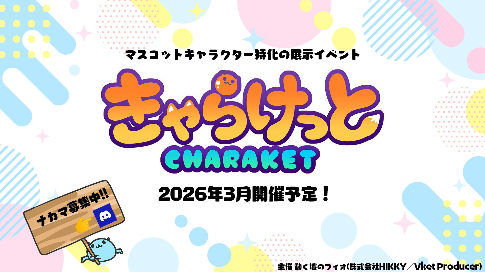

マスコットキャラクター特化の展示イベント
「きゃらけっと」を開催します！

- バーチャル空間で連れ歩けるペット
- ゆるキャラ、not人なアバター

などのマスコットキャラが一堂に会するマーケットをやりたい！

## 主催者の想い
Vket創設者で、現在もプロデューサーをやっています、フィオです。可愛いものが大好きです。ペットはハムスター。推しのガチャポンはVIRUSWEETS。

早速ですが、話を聞いて下さい！

「バーチャル空間発のマスコットキャラクター」が持つ熱量と可能性に魅了されて、きゃらけっとを立ち上げようと思い立ちました。

これまでも、アバターとしてかわいいいきものになったり、ペットや相棒として連れ歩いたりといった文化は、VRChatの中で広く受け入れられてきていたと思います。私自身も、自作の喋るめんだこをアバターの頭に載せています。

マスコットキャラクターに関わる何かがしたいな～、とぼんやり思い続けていましたが、VRChatでSpookality2025の一部として10/15に実装された”Companion Bundle”に衝撃を受けました。

今後、VRChatShopでアイテム販売が一般開放されていったら、バーチャル空間のペットはもっと身近になっていくと思います。クリエイターさんが作った渾身のキャラクターたちが、皆の周りにふよふよ浮かんでいる未来…最高すぎる。

これは「バーチャル空間発のマスコットキャラクター」の市場が爆発的に拡大する予兆だ！と感じました。私のこれまでの経験と、かわいいものが大好き！な情熱を全て注ぎ込んで、この新しい市場を牽引するようなイベントを立ち上げたいと思いました。それがこの「きゃらけっと」です。

きゃらけっとは、
・Vket創設～運営で培ったノウハウを活かしたバーチャル展示即売会
・マスコットキャラ好きが集う集会所や作業空間
・現実世界にマスコットキャラクターを顕現させる、グッズ展開を見据えたコンテスト
を通して、マスコット好きにとって嬉しい、マスコット制作者が報われるIP成長プラットフォームを目指したいと考えています。

本題です。
この新しいムーブメントを一緒に作り上げる仲間を探しています！
- イベント運営、一緒にやるよ！
- 展示ワールド、作ろうか？
- きゃらけっとに出展したい！
- 集会スタッフなら任せろ！
- リアルグッズ展開を考えてる！
- それやりたいとおもってたんよ！

そしてそして、

 - マスコットキャラクターがすき！

な方、私のこの話を読んで、ちょっとでも興味が湧いたなら、「きゃらけっと企画Discord」を立てたので、ぜひjoinしてください！ここまで読んでくださりありがとうございます。

きゃらけっとの開催を楽しみにしてください！
私自身も、とても楽しみです。

resource:[きゃらけっと公式Phio/動く城のフィオ X Postより](https://x.com/phio_alchemist/status/1979095320031117691)
